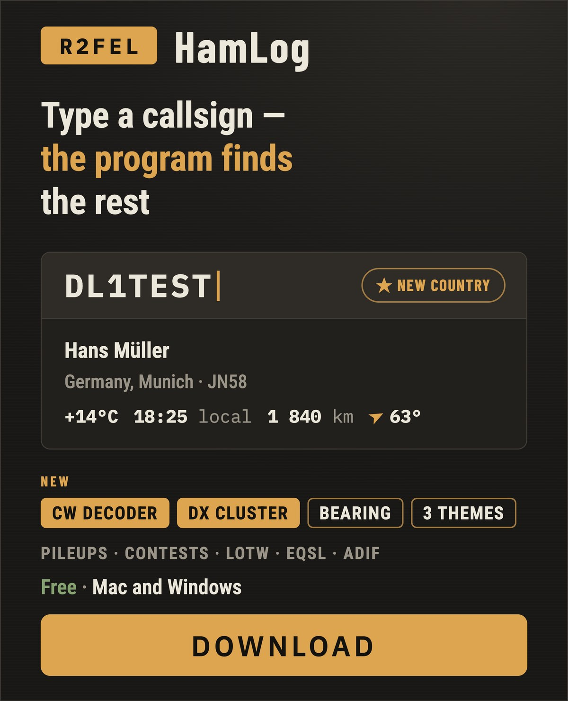
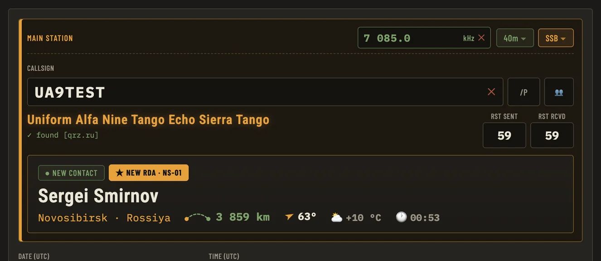
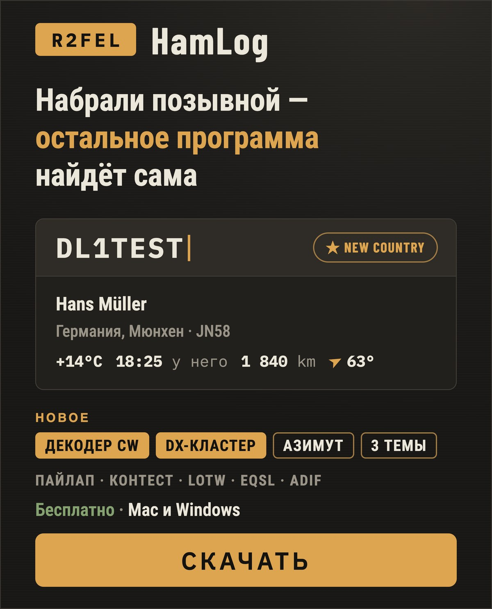
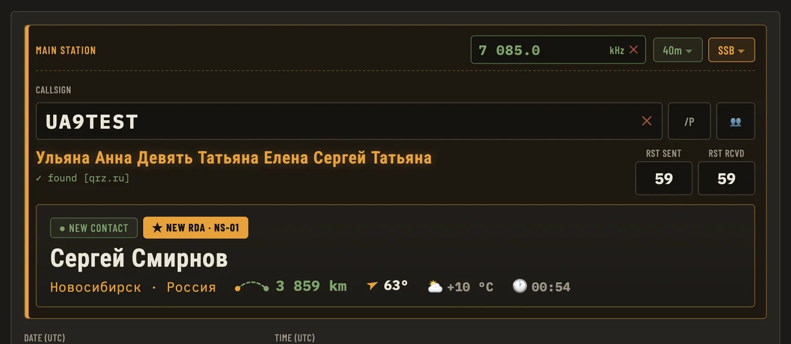

**По-русски:** [что это и где скачать ↓](#по-русски)

# R2FEL HamLog

**Site: [r2fel.com](https://r2fel.com)** · [releases](../../releases/latest) · [questions & ideas](../../discussions)

**A ham radio logbook that looks up the station you're working.** Type a callsign and it fills in the
operator's name, country, town, grid square and RDA district, shows the distance, the weather and the
local time where they are, and tells you at once whether you've worked them before.

Free, no subscription, no cloud: the log lives on your own computer. macOS and Windows — Windows 7 and
8 included.

[**⬇ Download the latest version**](../../releases/latest)

<br clear="right">



## What it does

- **Three callbooks at once.** QRZ.RU and HamQTH are asked together; QRZ.com fills in whatever neither
  of them knew. Russian stations come back with their names in Russian.
- **Weather and local time** at the other end, the distance along the great circle and the
  **bearing** — an arrow and degrees to point the antenna by.
- **Duplicates at a glance**: `WORKED BEFORE`, with every earlier contact one click away.
- **★ NEW COUNTRY / NEW RDA / NEW BAND** when a station, its district or the band is a first for you.
- **Pileups**: several stations in one entry — callsign, space, next callsign.
- **Contest mode**: serial numbers, `⟲ RESET`, and **Cabrillo** export.
- **DX cluster** built in: pick a node, click a spot and its callsign and frequency are in the form,
  each one marked `NEW` or `WORKED ×N` from your own log.
- **A Morse (CW) decoder**: listens to the microphone or a cable from the receiver and writes the
  letters, finds the speed by itself, tells two stations apart, explains the abbreviations under the
  words (PSE, QTH, 73).
- **QSL confirmations** in one place: **LoTW** (through TQSL), **eQSL** (upload, and the cards you
  receive), **HAMLOG** (by file), **award.srr.ru** and **RDA** awards, and **your own QSL card by
  e-mail** — your own picture with the fields placed on it, or a card the program draws from your
  details.
- **A log that fits you**: choose the columns, sort by any of them, three colour themes, and a full-screen
  window with the log in a tall column on the right. Tens of thousands of contacts without a stutter.
- **One log on several computers**: sync through a folder your cloud keeps in step (iCloud Drive,
  OneDrive, Yandex Disk, Dropbox) or by a file; nothing is deleted without asking. A **settings backup**
  brings a new computer to life in a minute.
- **CQ CALL**: ready words for a general call with your callsign spelled out and the band in words; with
  POTA park fields on, a POTA call — and 📍 offers the parks nearest to you.
- **Phonetic alphabet** under every field, the Russian way for RU, BY and KZ callsigns.
- **A manual in two languages**, with pictures and animations, inside the program (F1).
- **ADIF import and export**, an automatic copy of the log, and a repair for the mangled Cyrillic that
  other programs leave behind.

## Installing

Everything ready to run is on the [releases page](../../releases/latest):

| File | For |
|---|---|
| `R2FEL-LOG-<version>-arm64.dmg` | macOS (Apple Silicon) |
| `R2FEL-LOG-Setup-<version>.exe` | Windows 10 and 11 (64-bit) |
| `R2FEL-LOG-Setup-<version>-Windows7-8.exe` | Windows 7, 8, 8.1 and 32-bit |

The program isn't signed with a paid certificate, so your system will warn you that the developer is
unknown: on a Mac, right-click the icon → **Open**; on Windows, **More info** → **Run anyway**.

Callsign lookup needs free XML API access at QRZ.RU and/or a HamQTH account — the manual inside the
program (F1, "Settings") explains how to get both.

## What leaves your computer

Nothing from your log. Ever.

- **Callsign lookups, weather, RDA** go to QRZ.RU / HamQTH / QRZ.com and Open-Meteo, and only while
  you are typing a callsign. Your logins stay on your computer — and in the settings backup, if you switch that on (a copy in a folder you choose; the logins are in it as plain text, so switch them off there if the folder goes to a cloud).
- **LoTW, eQSL, HAMLOG, award.srr.ru, QSL by e-mail** — only when you press the button, and only what
  you send.
- **POTA parks near you** — only when you press 📍 with the park fields switched on: your coordinates go to
  api.pota.app to get the nearest parks. Nothing else, and never in the background.
- **DX cluster** — only when you press CONNECT: the node you pick sees your callsign, which is how
  clusters sign you in.
- **Microphone** (CW decoder) — switched on only by you; the sound is processed inside the program and
  goes nowhere.
- **Update check** — once a day the program asks whether a newer version is out and checks itself in
  with the author: country, version, system, language. No callsign, no log, not one contact. You can
  switch it off in settings (⚙ → UPDATES).

## Building from source

```bash
npm install                 # if Electron won't download: NODE_OPTIONS=--use-bundled-ca npm install
npm start                   # in a browser: http://localhost:4173
npm run electron            # the desktop version
npm run dist                # a DMG for macOS
npm run dist:win            # both Windows installers
```

Node.js 18 or newer. The whole program is plain HTML, CSS and JavaScript with no build step:
`public/index.html` (markup and styles), `public/app.js` (the logic), `server.js` (the callbook and
weather requests), `electron-main.js` (the desktop shell).

## Licence

MIT — do what you like with it, just keep the author's name. Author: Aleksei Aleksandrov, **R2FEL**.
Questions and ideas: [Discussions](../../discussions) or [r2fel@mail.ru](mailto:r2fel@mail.ru).

---

<a name="по-русски"></a>



# R2FEL HamLog — по-русски

**Сайт: [r2fel.com](https://r2fel.com)** · [релизы](../../releases/latest) · [вопросы и идеи](../../discussions)

**Журнал радиосвязей, который сам находит, с кем вы работаете.** Набираете позывной — программа
подставляет имя, страну, город, локатор и RDA, показывает расстояние, погоду и который час у
корреспондента, и сразу говорит, работали вы с ним раньше или нет.

Бесплатно, без подписок и без облака: журнал лежит на вашем компьютере. Mac и Windows, включая
Windows 7 и 8.

[**⬇ Скачать последнюю версию**](../../releases/latest)

<br clear="right">



## Что она умеет

- **Три справочника сразу.** QRZ.RU и HamQTH спрашиваются одновременно, а чего нет у них — дописывает
  QRZ.com. Имена российских станций — по-русски.
- **Погода и местное время** у корреспондента, расстояние по дуге большого круга и **азимут** —
  стрелка и градусы, куда поворачивать антенну.
- **Повторы видны сразу**: `WORKED BEFORE` и все прошлые связи с этой станцией по щелчку.
- **★ NEW COUNTRY / NEW RDA / NEW BAND** — когда страна, район или диапазон встречаются вам впервые.
- **Пайлап**: несколько станций в одной записи — позывной, пробел, следующий позывной.
- **Контест**: серийные номера, `⟲ RESET`, экспорт **Cabrillo**.
- **DX-кластер** прямо в программе: выбрали узел, щёлкнули по споту — позывной и частота в форме,
  и у каждого отметка `NEW` или `WORKED ×N` по вашему журналу.
- **Декодер телеграфа (CW)**: слушает микрофон или кабель от приёмника и пишет буквами, скорость
  определяет сам, различает две станции, под словами объясняет сокращения (PSE, QTH, 73).
- **Подтверждения QSL** в одном месте: **LoTW** (через TQSL), **eQSL** (отправка и приём картинок),
  **HAMLOG** (файлом), дипломы **award.srr.ru** и **RDA**, и **своя QSL-карточка по e-mail** — своя
  картинка с разметкой или карточка, которую программа рисует сама.
- **Журнал под себя**: колонки выбираются, сортировка по любой, три цветовые темы, а окно на весь экран
  ставит журнал высокой колонкой справа. Десятки тысяч связей без задержек.
- **Один журнал на нескольких компьютерах**: синхронизация через папку, которую держит ваше облако
  (iCloud Drive, OneDrive, Яндекс.Диск, Dropbox), или через файл; ничего не удаляется без вопроса.
  **Копия настроек** поднимает новый компьютер за минуту.
- **ВЫЗОВ CQ**: готовые слова общего вызова с вашим позывным по буквам и диапазоном словами; при
  включённых полях парков — вызов POTA, а 📍 предлагает ближайшие парки.
- **Фонетический алфавит** под каждым полем, с русским вариантом для RU, BY и KZ.
- **Инструкция на двух языках** — с картинками и анимациями, прямо в программе (F1).
- **Импорт и экспорт ADIF**, автоматическая копия журнала, чинит «кракозябры» в чужих файлах.

## Установка

Всё готовое — на [странице релизов](../../releases/latest):

| Файл | Для чего |
|---|---|
| `R2FEL-LOG-<версия>-arm64.dmg` | macOS (Apple Silicon) |
| `R2FEL-LOG-Setup-<версия>.exe` | Windows 10 и 11 (64 бит) |
| `R2FEL-LOG-Setup-<версия>-Windows7-8.exe` | Windows 7, 8, 8.1 и 32-битные |

Программа не подписана платным сертификатом, поэтому при первом запуске система предупредит, что
разработчик неизвестен: на Mac — правый щелчок по значку → **«Открыть»**, на Windows —
**«Подробнее»** → **«Выполнить в любом случае»**.

Для поиска позывных нужен бесплатный доступ к XML API QRZ.RU и/или аккаунт HamQTH — как их получить,
написано в инструкции внутри программы (F1, раздел «Настройки»).

## Что программа отправляет наружу

Ничего из журнала. Совсем.

- **Поиск позывных, погода, RDA** — запросы уходят к QRZ.RU / HamQTH / QRZ.com и Open-Meteo, только
  когда вы вводите позывной. Логины хранятся на вашем компьютере — и в копии настроек, если вы её включили (копия лежит в выбранной вами папке; логины в ней открытым текстом, поэтому если папка уходит в облако — выключите их там).
- **LoTW, eQSL, HAMLOG, award.srr.ru, QSL по e-mail** — только по нажатию кнопки и только то, что вы
  отправляете.
- **Парки POTA рядом** — только по нажатию 📍 при включённых полях парков: ваши координаты уходят на
  api.pota.app, чтобы получить ближайшие парки. Больше ничего и никогда в фоне.
- **DX-кластер** — только по кнопке CONNECT: узел, который вы выбрали, видит ваш позывной (так кластеры
  вас впускают).
- **Микрофон** (декодер CW) — включаете только вы; звук обрабатывается внутри программы и никуда не
  уходит.
- **Проверка обновлений** — раз в сутки программа проверяет, не вышла ли новая версия, и обезличенно
  отмечается у автора: страна, версия, система, язык. Ни позывного, ни журнала, ни одной связи.
  Выключается в настройках (⚙ → ОБНОВЛЕНИЯ).

## Собрать из исходников

```bash
npm install                 # если Electron не качается: NODE_OPTIONS=--use-bundled-ca npm install
npm start                   # в браузере: http://localhost:4173
npm run electron            # настольная версия
npm run dist                # DMG для macOS
npm run dist:win            # два установщика Windows
```

Нужен Node.js 18 или новее. Вся программа — обычный HTML, CSS и JavaScript без сборщиков:
`public/index.html` (разметка и стили), `public/app.js` (логика), `server.js` (запросы к справочникам),
`electron-main.js` (оболочка настольной версии).

## Лицензия

MIT — делайте с этим что хотите, только оставьте упоминание автора. Автор — Алексей Александров,
**R2FEL**. Вопросы и идеи — в [Discussions](../../discussions) или на [r2fel@mail.ru](mailto:r2fel@mail.ru).
